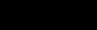

# The General Hamiltonian
Our General Hamiltonian looks like this

```math
\begin{aligned}
 \mathcal{H} &= \sum\limits_{\alpha = 1}^{N_\alpha} \mathcal{H}^{(\alpha)} 
              + \sum\limits_{\beta = 1}^{N_\beta} \mathcal{H}^{(\beta)} \\
             &= \sum\limits_{\alpha = 1}^{N_\alpha}J^{(\alpha)} \sum\limits_{\alpha\text{-bonds: }\langle i,j\rangle}  f^{(\alpha)} (\phi_i,\phi_j,D_{ij})
              + \sum\limits_{\beta = 1}^{N_\beta}h^{(\beta)} \sum\limits_{\beta\text{-sites: }i}  g^{(\beta)} (\phi_i)
\end{aligned}
```
it is split in interaction terms and on-site single particle contributions. The greek indices $`\alpha`$ and $`\beta`$ describe distinct *families* of bonds and spins, respectively. For clarity let us explain this concept using the following Figure. In panel (a) there is only one type (family) of sites (open circles), but two families of bonds, in this case referring to nearest (black lines) and next-nearest neighbour connections (blue lines). In the second panel (b) we see three different species of sites (red, blue, green), translating to three $`\beta`$-families in our framework. Finally, panel (c) shows a typical example of a disordered lattice, with only one family of either bonds and sites.


<p align="center">
</p>


Keep in mind: The dimension of the target set of $`f^{(\alpha)}`$ needs to match the dimension of $`J^{(\alpha)}`$ in order to be able to perform a meaningful scalar product. The same holds for $`g^{(\beta)}`$ in combination with $`h^{(\beta)}`$, compare the XXZ Heisenberg example below. *Note to ourselves: Implement a check for this!*


# Examples

The following Hamiltonians fit into this framework with the respective substitutions given:


* Example 1: **Ferromagnetic Ising model in homogeneous external field**

    ```math
    \mathcal{H} = -J\sum\limits_{\langle i,j\rangle} \phi_i\phi_j + h\sum\limits_{i} \phi_i
    ```

    ```math
    N_\alpha=N_\beta = 1, \quad \phi_i\in\{-1,+1\}, \quad J^{(1)} = -J, \quad h^{(1)} = h
    ```
    
    ```math
    f^{(1)} = \phi_i \phi_j, \quad g^{(1)} = \phi_i 
    ```

* Example 2: **Diluted Heisenberg antiferromagnet**
    
    ```math
    \mathcal{H} = J\sum\limits_{\langle i,j\rangle} \epsilon_i \epsilon_j \vec{\phi_i}\vec{\phi_j}
                    \quad\text{where}\quad \epsilon_i,\epsilon_j\in\{0,1\}
    ```
    The binary variables $`\epsilon`$ encode whether the corresponding site is magnetic ($`\epsilon=1`$) or a non-interacting impurity ($`\epsilon=0`$). Note that there is some redundancy in this notation. If the lattice (which is the set of sites $`i`$ and the set of bonds $`\langle i,j\rangle`$) does not include impurity sites in the first place, the $`\epsilon`$'s can be discarded.

    ```math
    N_\alpha=1 \quad \phi_i\in\mathbb{R}^3, \quad |\phi_i|^2=1, \quad J^{(1)} = (J,J,J)^T
    ```
    
    ```math
    f^{(1)} = \phi_i^T \phi_j
    ```
    
    

* Example 3: **Spin glass**
    
    ```math
    \mathcal{H} = J\sum\limits_{\langle i,j\rangle} \epsilon_{ij} \phi_i \phi_j
                    \quad\text{where}\quad \epsilon_i,\epsilon_j\in\left[-1,1\right] \text{(random)}
    ```
    Note that since the $`\epsilon_{ij}`$ take on random positive and negative values, the system is neither ferro- nor antiferromagnetic but rather becomes a prototypical spin glass.
    

    ```math
    N_\alpha=1 \quad \phi_i\in\mathbb{R}^N, \quad |\phi_i|^2=1, \quad J^{(1)} = 1
    ```
    
    ```math
    f^{(1)} = D_{ij} \phi_i^T \phi_j \quad\text{where } D_{ij} \text{ are tabulated scalar values}
    ```

* Example 4: **Spin ice with dipolar interactions**
    ```math
    \mathcal{H} =   - J \sum\limits_{\langle i,j\rangle}\phi_i \phi_j
                    + Da^3 \sum\limits_{i>j}\Bigg[\frac{\phi_i\phi_j}{|\bm{r}_{ij}|^3}
                    - 3 \frac{(\bm{\phi}_i\cdot \bm{r}_{ij})(\bm{\phi}_j\cdot \bm{r}_{ij})}{|\bm{r}_{ij}|^5}\Bigg]
    ```
    This Hamiltonian is typically defined on a *pyrochlore* lattice and the second term represens long-range dipolar interactions which can be efficiently computed using the Ewald summation technique.


* Example 5: **XXZ Heisenberg in Y external field**


    ```math
    N_\alpha=N_\beta = 1, \quad \phi_i\in\mathbb{R}^3, \quad |\phi_i|^2=1
    ```
    This example demonstrates how direction-dependent couplings can be introduced.
    
    
    ```math
    J^{(1)} = 1, \quad h^{(1)} = (0, h_y, 0)^T
    ```
    
    ```math
    f^{(1)}:X\mapsto\mathbb{R}, \qquad
    X =  \Bigl\{(\phi_i,\phi_j,D_{ij}) \vert \phi_i,\phi_j\in\mathbb{R}^3, D_{ij}\in\mathbb{R}^{3\times 3}\Bigr\}  \\
    ```
    ```math
 
    f^{(1)}(\phi_i,\phi_j,D_{ij}) = \phi_i^T D_{ij} \phi_j, \quad\text{where}\quad D_{ij}=\begin{pmatrix} J_x & 0 & 0 \\ 0 & J_x & 0 \\ 0 & 0 & J_z \end{pmatrix}
    ```
    
    ```math    
    g^{(1)}:\phi_i\mapsto\mathbb{R}^3, \qquad g^{(1)}(\phi_i) = \phi_i 
    
    ```

* Example 6: **Blume-Capel model**
 
    ```math
    \mathcal{H} = -J\sum\limits_{\langle i,j\rangle} \phi_i\phi_j + D\sum\limits_{i} \phi_i^2
    ```
    
    ```math
    N_\alpha=N_\beta = 1, \quad \phi_i\in\{-1,0,+1\}, \quad J^{(1)} = J, \quad h^{(1)} = D
    ```
    
    ```math
    f^{(1)} = \phi_i \phi_j, \quad g^{(1)} = \phi_i^2 
    ```

* Example 7: **Improved O(N) lattice field theory**

    ```math
    \mathcal{H} = -\beta\sum\limits_{\langle i,j\rangle} \phi_i \phi_j + m\sum\limits_i \phi_i^2 + \lambda\sum\limits_i (\phi_i^2-1)^2
    ```

    ```math
    N_\alpha=1, \quad N_\beta=2, \quad \phi_i\in\mathbb{R}^N
    ```
    ```math    
    \quad J^{(1)} = -\beta, \quad h^{(1)}=m, \quad h^{(2)}=\lambda
    ```    
    ```math
    f^{(1)} = \phi_i^T \phi_j, \quad g^{(1)} = \phi_i^2, \quad g^{(2)} = (\phi_i^2-1)^2 
    ```    
    all sites in the lattice are included for $`\beta=1`$ und $`\beta=2`$
    

* Example 8: **Clock model**

    ```math
    N_\alpha= 1, \quad \phi_i\in\{0,1,\ldots,p-1\}, \quad J^{(1)} = J
    ```
    ```math
    f^{(1)} = \cos\Big(2\pi(\phi_i- \phi_j)/p\Big)
    ```
    
* Example 9: **Disordered Baxter-Wu model**

    ```math
    \mathcal{H} = -J\sum\limits_{\langle i,j,k\rangle} \epsilon_i \epsilon_j \epsilon_k \phi_i\phi_j\phi_k, 
                    \quad\text{where}\quad \epsilon_i,\epsilon_j,\epsilon_k\in\{0,1\}
    ```
    defined on a triangular two-dimensional lattice, where particles are e.g. regular Ising spins...


    *Is this model covered? The third interaction partner might be sneaked in via the interaction D?*
    

* Example 10: **N-color Ashkin-Teller model**
    ```math
    \mathcal{H} =   - J\sum\limits_{\alpha=1}^N\sum\limits_{\langle i,j\rangle} \phi^\alpha_i\phi^\alpha_j 
                    - K \sum\limits_{\alpha<\beta}\sum\limits_{\langle i,j\rangle} \phi^\alpha_i\phi^\alpha_j \phi^\beta_i\phi^\beta_j
    ```  
    An implementation of this Hamiltonian is not straightforwardly possible based on the above general form, as it requires an interaction term that couples spins of *different* families.


