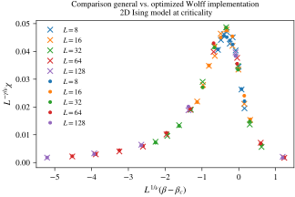

# Update Algorithms

## Notes

* Cluster representations and the Wolff algorithm in arbitrary external fields; includes a C++ header library for most common models: `kent2018`
* Detailed analysis of Hybrid Algorithms (i.e. Metropolis+Wolff) for Spin-1/2 and Spin-3/2 Ising model: `plascak2002`
* Mixed cluster algorithm for 3-state Ising model: `bouabci1996`
 

## Cluster Algorithms

For the 2D Ising model at criticality, the specially optimized version of the Wolff algorithm is about 20% faster than the more generic one. The data collapse in the picture provides decent evidence that both algorithms provide correct results. Results from the generic algorithm are denoted by dots whereas the optimized ones are represented by circles. In the simulations also occasional Metropolis sweeps were used to efficiently equilibrate short-range modes.

