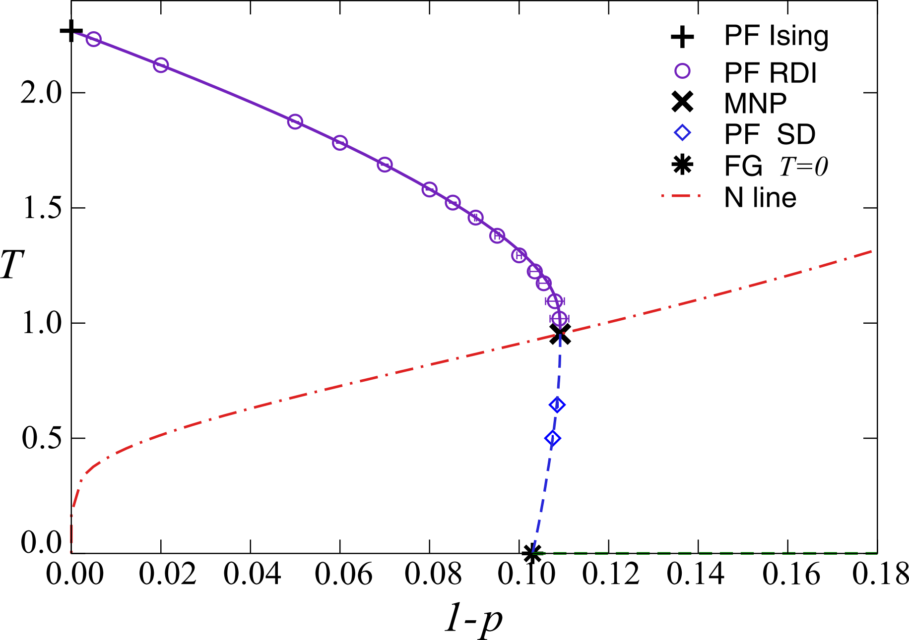
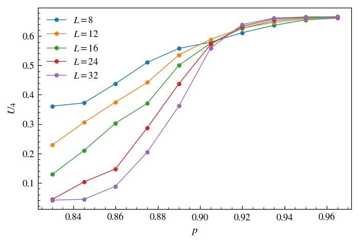

# Already implemented

* Spin-1/2 Ising model 
  Implemented in `Ising.h`; Metropolis, specialized and general Wolff cluster algorithm available, all three work fine; tested in 2D and 3D via critical scaling collapses

* O(3) model: 
  Implemented in `Heisenberg.h`; Metropolis, specialized and general Wolff cluster algorithm available, all three work fine; tested in 3D via critical scaling collapses; no phase transition in 2D; reference values can be found in `campostrini2002` and `hasenbusch2011`

* O(3) with $`\phi^4`$ interaction: 
  Implemented in `Phi4.h`; correct critical exponents, but critical temperature is off (see corresponding Issue for details); main references are `hasenbusch2001`, `campostrini2002`, `hasenbusch2011`

* Blume-Capel model  
  Implemented in `BlumeCapel.h`; Extension to integer spin values $`\{-1,0,1\}`$, which calls for a hybrid MC scheme, as the Wolff algorithm does not affect zero-spins; current implementation of the Metropolis and Wolff algorithms are only obvious guesses at the moment, i.e. as it stand it is unclear whether updates obey the detailed balance condition strictly; nonetheless, tested in 3D via critical scaling collapses for a specific parameter choice; results match expected numbers from `hasenbusch2010`, `hasenbusch2018`

* XXZ antiferromagnet: 
  Implemented in `XXZAntiferro.h`; Tested at two points in the T/H phase diagram: Found second-order transition from the AF into the paramagnetic phase at $`\beta=0.6384`$, $`H=0`$ and from the SF into the paramagnetic phase at $`\beta=0.98`$, $`H=4.2`$, consistent with recent literature, such as `selke2009`, `selke2011` and `hu2014`; due to lack of precision critical exponents could not be confirmed so far; note: make sure that the Wolff cluster algorithm is only used at zero external field

* Square-Lattice $`\pm J`$ Ising model 
  Requires to generalize the Metropolis algorithm to support bond weights and initiated the implementation of a general disorder class. In the model, a random fraction $`(1-p)`$ of bonds carry an antiferromagnetic coupling. This leads to the following phase diagram (from `toldin2009`)
  

  

  Due to the glassy behaviour, numerical simulations are restricted to small lattice sizes, especially for low temperatures. Standard metropolis dynamics should work everywhere in the phase diagram, however, parallel tempering seems to be the prefered method here, especially at low temperatures. Cluster algorithms are said to be very inefficient in most parts of the phase diagram.
  To test the disorder class, we simulated at $`T=1.5`$ for a number of probabilities around the PF line, where a continous transition controlled by Ising universality with strong logarithmic correction should emerge. Using 40 disorder replicas for every temperature, as well as a number of 3000 equilibration steps and 10.000 measurements, where between every step 15 metropolos lattice sweeps have been performed, the transition could be located at $`p_c\approx 0.913`$
  

  

  
  A data collapse of the critical region in the bond exchange probability seems to confirm the Ising scenario. Corresponding simulations took about 400 CPU hours.
  

  

  
* Ashkin-Teller model: We use it as an example where almost nothing of the structure of the general Hamiltonian is actually used. Tested for K=0 (three decoupled Ising models) and K=0.3, where according to Zhu et. al 2015 a phase transition is located at beta = 0.315... Both cases can be reproduced!

# Up next

